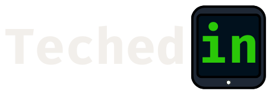

# TechedIn
### The student technologists' AI-powered matchmaker! Share and view project ideas to find your dream team.
Team Members: Daniela Zbib, Alejandro Hernandez, Mahamud Babu, Huda Ayaz

## Inspiration
Although students studying Computer Science or related fields are equipped with the foundation needed to pursue a career in technology, their education often misses out on providing students with the relevant experience gained through internships and personal projects. Hackathons are a great opportunity for the creation of these projects and learning valuable teamwork and communication skills. Otherwise, students create solo projects on their own time **or, worse, graduate without any real experience under their belt and struggle with finding full-time jobs.**
## What it does
TechedIn is a social media platform that uses AI analysis to match student technologists to one another so that they can share project ideas and build their dream team. Students can input their interests, post their own projects in search of teammates, explore other people’s projects through the AI-recommended homepage, and instantly connect with students who resonate with their ideas. The platform acts as a bridge for collaboration, **enabling students to take their concepts from mere ideas to actual production and deployment.**
## How we built it
The platform features a responsive design using Tailwind CSS and Mantine. The fixed layout features a menu, **a list of the most popular repositories** that is pulled and filtered from the GitHub API as a constant source of inspiration for your next big idea, and four core pages: **Home**, **Notifications**, **Projects**, and **Profile**.
The **Home** page, built with React and Node.js, allows users to create posts to share their own project ideas or view a list of recommended projects, ranked using AI analysis with Cloudflare and Python. Our machine learning algorithm for ranking was conducted based on:
1.  **Interests** that users select upon registering for an account and can edit whenever they want,
2. **Experience** extracted from analyzing the user’s GitHub profile and statistics for certain skills, tools, topics, and languages,
3. **Location** based on user colleges, so that relevant projects by students closest to each other are prioritized.
Users can express interest in a project with the click of a button. This sends a **notification** to the project owner, who can then assess the interested user’s eligibility for the project by perusing their **profile**, which includes the user’s interests and **graphically displayed statistics of their experience** gathered via the **GitHub API**.
If the project owner accepts the user onto their team, the new team member receives a notification that allows them to instantly email the project owner with a pre-populated message **and get their project started!**
These components all come together to preview what an end-to-end process from project ideation to team creation would look like on TechedIn.
## Challenges we ran into
We spent a significant amount of time planning out what features to include, designing an MVP, and specifying our functional goals. A social media platform incorporates so many moving parts that keeping track of everything and ensuring our frontend and backend are interwoven seamlessly was the biggest challenge. With constant communication and a clear plan, we were able to mitigate any ambiguity and stay ahead of the rough patches.
Another challenge was creating an effective AI recommendation system that accurately matches students with projects based on their interests and skills. Although Cloudflare was a new technology to us, it was the tool that aided us in obtaining a list of recommended projects for our users.
## Accomplishments that we're proud of
We are proud of successfully creating a platform that not only connects students but also enhances their collaboration experience through AI-driven recommendations. Our team’s ability to stay in communication with each other, collaborate on roadblocks, and keep each other’s spirits up left us with a memorable and satisfying hackathon experience. We’re excited for the foundation of TechedIn that we’ve developed and can’t wait to continue to collaborate with each other, in the spirit of our platform’s mission.
## What we learned
Throughout the development process, we learned the importance of effective communication within a team and the value of adaptability when facing challenges. We also gained insights into machine learning algorithms and their practical applications in real-world scenarios, particularly with the help of technologies like Cloudflare. Understanding user experience principles helped us create a more intuitive interface, making our platform accessible to all students, and keeping in mind the architecture of our web application allowed us to keep all the moving parts of the app in mind.
## What's next for TechedIn
Looking ahead, we plan to expand the platform's features by incorporating additional tools for project management and collaboration, such as real-time chat and video conferencing. Our demo displays a logged in view of how the site would work, but next steps would include incorporating proper authorization. We also aim to enhance our AI algorithms for better project recommendations and explore partnerships with educational institutions to broaden our user base. At the end of the day, projects are an opportunity to make lifelong connections and have fun sharing your passion with like minded peers, and we would want TechedIn to be a welcoming platform to be able to do just that.
